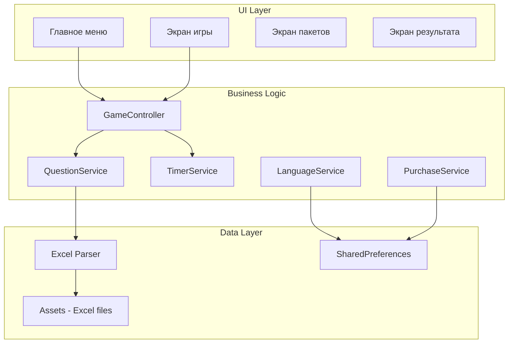

# План разработки приложения "Blim Bilem"

## Архитектура приложения




## Структура проекта

```javascript
blim_bilem/
├── lib/
│   ├── main.dart
│   ├── app.dart
│   ├── screens/
│   │   ├── main_menu_screen.dart
│   │   ├── game_screen.dart
│   │   ├── packages_screen.dart
│   │   ├── result_screen.dart
│   │   └── timeout_screen.dart
│   ├── widgets/
│   │   ├── language_button.dart
│   │   ├── menu_button.dart
│   │   ├── answer_button.dart
│   │   ├── timer_widget.dart
│   │   └── package_badge.dart
│   ├── models/
│   │   ├── question.dart
│   │   └── package_info.dart
│   ├── services/
│   │   ├── question_service.dart
│   │   ├── language_service.dart
│   │   ├── timer_service.dart
│   │   ├── excel_parser.dart
│   │   └── purchase_service.dart
│   ├── providers/
│   │   ├── game_provider.dart
│   │   └── language_provider.dart
│   └── constants/
│       ├── colors.dart
│       └── strings.dart
├── assets/
│   ├── data/
│   │   ├── questions_kz.xlsx
│   │   ├── questions_ru.xlsx
│   │   ├── phrases_kz.xlsx
│   │   └── history_kz.xlsx
│   └── images/
│       ├── trophy.png
│       └── medal.png
└── pubspec.yaml
```


## Этапы разработки

### Этап 1: Базовая настройка проекта

- [x] Создание Flutter проекта
- [x] Настройка зависимостей в `pubspec.yaml`:
- [x] `excel` - парсинг Excel файлов
- [x] `provider` - state management
- [x] `shared_preferences` - хранение настроек
- [x] `in_app_purchase` - покупки
- [x] `google_fonts` - шрифты
- [x] Копирование Excel файлов в `assets/data/`
- [x] Настройка структуры папок

### Этап 2: Парсер Excel и модели данных

- [x] Модель `Question`:
  ```dart
                        class Question {
                          final String text;
                          final List<String> answers; // 6 вариантов
                          final int correctAnswerIndex; // всегда 0 в исходных данных
                          final Difficulty difficulty; // easy, medium, hard
                          final String? packageId; // null для базовых вопросов
                        }
  ```

- [x] Сервис `ExcelParser` для чтения вопросов из assets
- [x] Структура Excel: 3 листа (простые/средние/сложные), правильный ответ всегда первый
- [x] Метод `parsePhrases` для парсинга мотивирующих фраз

### Этап 3: Сервис локализации

- [x] `LanguageService` с поддержкой KZ/RU
- [x] Сохранение выбора в SharedPreferences
- [x] Казахский язык по умолчанию
- [x] Строковые константы:

| Ключ | Казахский | Русский ||------|-----------|---------|| start | СТАРТ ОЙЫН | СТАРТ ИГРЫ || additional_questions | ҚОСЫМША СҰРАҚТАР | ДОПОЛНИТЕЛЬНЫЕ ВОПРОСЫ || exit_game | ОЙЫННАН ШЫҒУ | ВЫХОД ИЗ ИГРЫ || more_questions | Көбірек сұрақтар | Больше вопросов || history | Қазақстан тарихы | История Казахстана || timeout_message | Ты не успел. Попробуй еще раз | К сожалению, ты не успел ответить || restart | ҚАЙТА БАСТАУ | НАЧАТЬ ЗАНОВО || main_menu | БАСТЫ МӘЗІРГЕ | В ГЛАВНОЕ МЕНЮ |
- [x] `LanguageProvider` для state management

### Этап 4: Главное меню

- [x] Заголовок "BLIM BILEM" с трофеем и лампочкой
- [x] Кнопка СТАРТ (зеленая, крупная)
- [x] Кнопки KZ/RU (синяя/красная, крупные, рядом)
- [x] Кнопка "Дополнительные вопросы" (синяя)
- [x] Кнопка "Выход" (оранжевая)
- [x] Градиентный фон (голубой к желтому)
- [x] Стиль кнопок: закругленные, с тенью, 3D-эффект
- [x] Интеграция с LanguageProvider для динамической локализации
- [x] Навигация на экраны игры и пакетов

### Этап 5: Игровой экран

- [x] Таймер 13 секунд сверху (визуально заметный)
- [x] Текст вопроса по центру
- [x] 6 кнопок ответов под вопросом
- [x] Значок пакета рядом с вопросом (если из пакета)
- [x] Логика рандомизации ответов (правильный ответ перемешивается)
- [x] Интеграция с TimerService
- [x] Интеграция с GameProvider
- [x] Обработка выбора ответа
- [x] Навигация на экраны результата и timeout

### Этап 6: Логика игры

- [x] Выборка 13 вопросов: 4 простых + 6 средних + 3 сложных
- [x] Рандомизация из общего пула (базовые + купленные пакеты)
- [x] Перемешивание вариантов ответов
- [x] Проверка правильности ответа
- [x] Переход к следующему вопросу или результату
- [x] Интеграция QuestionService с GameScreen
- [x] Загрузка вопросов по выбранному языку

### Этап 7: Подсказки в игре (3 вида)

- [x] Подсказка 1 — Проверка ответа:
  - Игрок может выбрать любой вариант ответа
  - Если ответ неверный:
    - Выбранный вариант подсвечивается красным
    - Отображается текст "Неверно" вместо текста варианта
    - Подсветка и текст показываются 2 секунды
    - Затем вариант ответа возвращается в исходное состояние
  - Если ответ верный:
    - Выбранный вариант подсвечивается зеленым
    - Отображается текст "Верно" вместо текста варианта
    - Подсветка и текст показываются 2 секунды
    - После этого игра продолжается
  - Подсказка не завершает игру и используется только для проверки

- [x] Подсказка 2 — 50/50:
  - При активации подсказки:
    - 3 неверных ответа выбираются случайным образом
    - Выбранные ответы:
      - Становятся некликабельными
      - Текст ответа исчезает
    - Оставшиеся варианты ответа продолжают работать
    - Правильный ответ никогда не скрывается

- [x] Подсказка 3 — Замена вопроса:
  - При активации подсказки:
    - Текущий вопрос полностью заменяется на другой
    - Новый вопрос выбирается из того же уровня сложности
    - Таймер сбрасывается и запускается заново
    - Номер вопроса сохраняется (например, был 5-й вопрос — остается 5-м)
  - Замена вопроса не влияет на общий прогресс игры

- [x] UI для активации подсказок (кнопки/иконки)
- [x] Логика управления использованием подсказок
- [x] Расширение AnswerButton для поддержки различных состояний
- [x] Интеграция подсказок с GameProvider и QuestionService

### Этап 8: Таймер и экран "Время вышло"

- [x] Обратный отсчет 13 секунд (реализован в TimerService)
- [x] При истечении: экран с сообщением (TimeoutScreen)
- [x] Кнопки: "Начать заново" / "В главное меню"
- [x] Интеграция с локализацией (KZ/RU)
- [x] Сброс состояния игры при переходе

### Этап 9: Экран победы

- [x] Золотой кубок/медаль (иконка трофея)
- [x] Случайная мотивирующая фраза из Excel
- [x] Кнопки продолжения ("Начать заново" / "В главное меню")
- [x] Интеграция с локализацией (KZ/RU)
- [x] Загрузка фраз из phrases_kz.xlsx

### Этап 10: Экран дополнительных пакетов

- [x] Список пакетов с цветовыми значками:
  - [x] "Больше вопросов" (фиолетовый цвет)
  - [x] "История Казахстана" (коричневый цвет)
- [x] Статус: куплен / не куплен
- [x] Кнопка покупки (заглушка, реальная покупка будет на этапе 11)
- [x] Интеграция с локализацией (KZ/RU)
- [x] Отображение статуса покупки (галочка для купленных)
- [x] Навигация назад в главное меню

### Этап 11: In-App Purchase интеграция

- [x] Настройка `in_app_purchase` пакета (уже добавлен в pubspec.yaml)
- [x] Инициализация InAppPurchase и проверка доступности
- [x] Загрузка продуктов через queryProductDetails
- [x] Обработка покупок через purchaseStream
- [x] Покупка non-consumable продуктов через buyNonConsumable
- [x] Восстановление покупок через restorePurchases
- [x] Сохранение статуса покупок локально (SharedPreferences)
- [x] Обработка статусов покупок (pending, purchased, restored, error)
- [x] Завершение покупок через completePurchase
- [x] Интеграция с PackagesScreen
- [x] UI для восстановления покупок
- [ ] Конфигурация продуктов в App Store / Google Play (требует настройки в магазинах)

### Этап 12: Админ-панель

#### 12.1 Общая структура админ-панели

- [x] Создание экрана входа в админ-панель (авторизация)
- [x] Главный экран админ-панели с тремя разделами:
  - [x] **Общедоступные** - управление основным пулом вопросов
  - [x] **Пакетные** - управление платными пакетами
  - [x] **ФинФразы** - управление финальными мотивирующими фразами
- [x] Навигация между разделами (кликабельные окна)
- [x] Система авторизации администратора
- [x] Возможность смены пароля администратора
- [x] Backend API (Node.js/Express + MongoDB)
- [x] Frontend (React + Vite)
- [x] Конфигурация для деплоя на Render

#### 12.2 Раздел «Общедоступные»

- [x] Два блока загрузки Excel:
  - [x] Excel на казахском языке
  - [x] Excel на русском языке
- [x] Для каждого блока:
  - [x] Кнопка «Загрузить Excel» (file picker)
  - [x] Кнопка «Удалить файл» (с подтверждением действия)
  - [x] Индикатор загруженного файла (название/размер)
- [x] Логика загрузки:
  - [x] Новый файл полностью заменяет предыдущий
  - [x] Данные автоматически применяются в игре
  - [x] Обновление приложения не требуется
  - [x] Загруженный файл нельзя скачать
- [x] UI компонент с обработкой ошибок и успешных загрузок
- [x] Валидация файлов (тип, размер)
- [x] Отображение информации о загруженных файлах (дата, размер)

#### 12.3 Раздел «ФинФразы»

- [x] Два блока загрузки Excel:
  - [x] Excel на казахском языке
  - [x] Excel на русском языке
- [x] Для каждого блока:
  - [x] Кнопка «Загрузить Excel»
  - [x] Кнопка «Удалить файл» (с подтверждением)
  - [x] Индикатор загруженного файла
- [x] Структура Excel:
  - [x] Одна колонка — текст фразы
- [x] Логика применения:
  - [x] Фразы выбираются рандомно при победе
  - [x] Применяются без обновления приложения
  - [x] Файл нельзя скачать
- [x] UI компонент с примером структуры Excel файла
- [x] Валидация файлов (тип, размер до 5MB)
- [x] Отображение информации о загруженных файлах

#### 12.4 Раздел «Пакетные»

##### 12.4.1 Список пакетов

- [x] Отображение списка доступных пакетов
- [x] Пакеты по умолчанию:
  - [x] "Больше вопросов" (дефолтная цена: 1000 ₸)
  - [x] "История Казахстана" (дефолтная цена: 1000 ₸)
- [x] Для каждого пакета отображаются:
  - [x] Название пакета (редактируемое поле)
  - [x] Цвет значка пакета (выбор цвета через color picker)
  - [x] Цена пакета (редактируемое поле, в тенге)
  - [x] Тумблер Активен / Неактивен
  - [x] Кнопка «Удалить пакет» (с подтверждением)
- [x] Кнопка создания нового пакета
- [x] Редактирование названий на KZ и RU
- [x] Визуальная индикация активных/неактивных пакетов

##### 12.4.2 Логика активации пакета

- [x] **Активен:**
  - [x] Пакет отображается в приложении
  - [x] Доступен пользователям для покупки
- [x] **Неактивен:**
  - [x] Пакет исчезает из магазина в приложении
  - [x] Пользователи не могут купить пакет
  - [x] Пользователи, которые купили пакет ранее, сохраняют доступ к вопросам
- [x] Публичный API endpoint `/api/public/packages` для получения только активных пакетов
- [x] Метод `findActive()` в модели Package для фильтрации активных пакетов
- [x] Документация по логике активации пакетов

##### 12.4.3 Управление значком пакета

- [x] Выбор цвета значка для каждого пакета
- [x] Значок отображается:
  - [x] Рядом с названием пакета в приложении
  - [x] Рядом с вопросом, если он взят из данного пакета
- [x] Color picker в админ-панели (визуальный выбор + текстовый ввод)
- [x] Цвет передается через публичный API в приложение
- [x] Документация по использованию цвета значка в приложении

##### 12.4.4 Удаление пакета

- [x] Кнопка «Удалить пакет» с подтверждением
- [x] После удаления:
  - [x] Пакет полностью исчезает из админ-панели
  - [x] Пакет не используется в игре
- [x] Улучшенное подтверждение удаления с предупреждением
- [x] Удаление связанных файлов пакета
- [x] Автоматическое удаление из базы данных (ON DELETE CASCADE)
- [x] Документация по удалению пакетов

##### 12.4.5 Создание нового пакета

- [x] Кнопка «+» в разделе «Пакетные»
- [x] При нажатии создается новый пустой пакет:
  - [x] Название: пустое
  - [x] Цвет значка: дефолтный (#4CAF50)
  - [x] Цена: 1000 тенге (дефолтная)
  - [x] Статус: активен
- [x] После создания пакет автоматически открывается в режиме редактирования
- [x] Круглая кнопка "+" с hover эффектом

##### 12.4.6 Внутренний экран пакета

- [x] При переходе внутрь конкретного пакета:
  - [x] Два блока загрузки Excel:
    - [x] Excel на казахском языке
    - [x] Excel на русском языке
  - [x] Для каждого блока:
    - [x] Кнопка «Загрузить Excel»
    - [x] Кнопка «Удалить файл»
    - [x] Индикатор загруженного файла (статус, имя файла, размер, дата загрузки)
  - [x] Файл нельзя скачать (нет функционала скачивания)
- [x] Навигация назад к списку пакетов
- [x] Валидация формата файла (только .xlsx, .xls)
- [x] Автоматическая замена старого файла при загрузке нового

#### 12.5 Техническая реализация

- [x] Backend API для админ-панели (Node.js/Express с PostgreSQL)
- [x] Хранение файлов Excel на сервере (multer, папка uploads/)
- [x] Синхронизация данных с приложением (публичный API /api/public/packages)
- [x] Система авторизации (JWT токены)
- [x] Валидация загружаемых Excel файлов (MIME type проверка: .xlsx, .xls)
- [x] Обработка ошибок загрузки (try-catch блоки, сообщения об ошибках)
- [x] UI компоненты для админ-панели:
  - [x] File picker для загрузки Excel (input type="file" accept=".xlsx,.xls")
  - [x] Color picker для выбора цвета значка (input type="color" + текстовый ввод HEX)
  - [x] Toggle switch для активации/деактивации (кастомный checkbox стиль)
  - [x] Диалоги подтверждения удаления (window.confirm с детальными сообщениями)
  - [x] Формы редактирования пакетов (inline редактирование в PackageCard)

#### 12.6 Безопасность

- [x] Админка доступна только авторизованным пользователям (ProtectedRoute на всех страницах)
- [x] Возможность смены пароля администратора (страница /change-password)
- [x] Защита от несанкционированного доступа (JWT токены, middleware authenticateToken)
- [x] Валидация прав доступа на сервере (проверка токена на каждом запросе)
- [x] Хеширование паролей (bcrypt)
- [x] Валидация паролей (минимум 6 символов, проверка текущего пароля)
- [x] Документация по безопасности

### Этап 13: Полировка UI

- Анимации кнопок
- Переходы между экранами (без задержек)
- Адаптация под разные размеры экранов
- Тестирование на iOS и Android